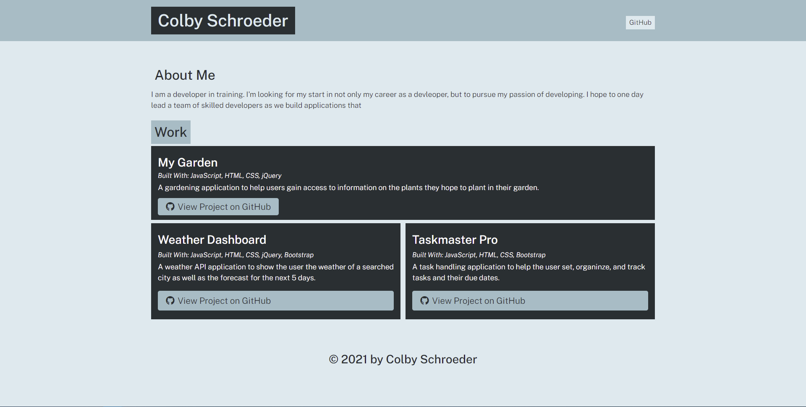

# Portfolio Generator

This application helps the user create a portfolio to feature information about them, their GitHub link, and any projects they have worked on.

## Description
**THIS IS A NODE.JS APPLICATION**. 

In order to use ths application you must clone it locally to your machine and have [node.js](https://nodejs.org/en/) installed along with access to a command line interface (VS code, Git Bash, Terminal, etc).

To use this application, be sure you have all the required extensions installed.
1) From the command line, navigate to the cloned directory and run `node app`
2) Follow the prompts to enter information about yourself and information about the different projects you have created/participated in.
3) Once finished, you should be met with a message indicating the files have been created in the `dist` directory
    * The `dist` directory will have the index.html and style.css required for a deployed application
4) Use the index.html and style.css (feel free to adjust the style.css for your own personal touch!) to deploy your own portfolio.

## Screenshot

## Link
**THERE IS NO DEPLOYED LINK FOR THIS APPLICATION**

The intended purpose of this application is for you to clone if locally and generate then deploy your own version of the portfolio page.

## Resources
[node.js](https://nodejs.org/en/)
[inquirer npm](https://www.npmjs.com/package/inquirer)
[file-system npm](https://www.npmjs.com/package/file-system)